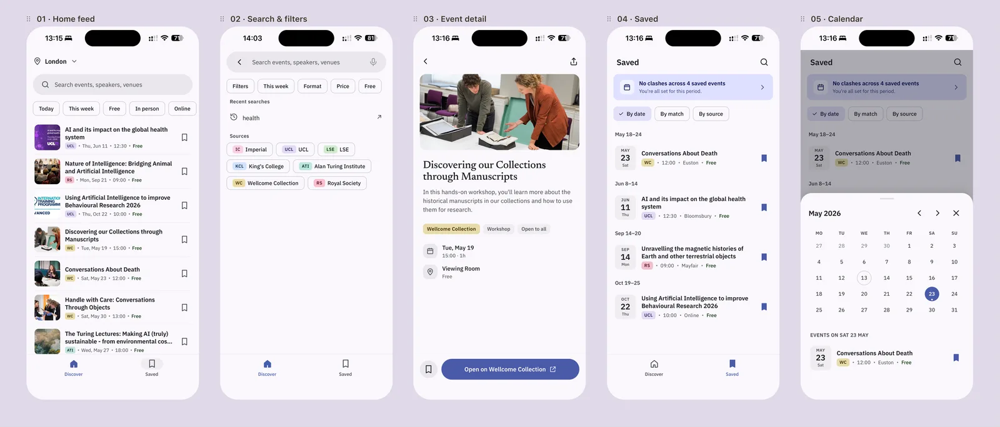

# Signal

Event discovery for London, from many sources in one feed.

**[Live demo](https://signal-app-blush.vercel.app)** · Prototype, mobile layout



## Why I built it

Public events in London are spread across university pages, research institutions and community groups. Signal brings them into one feed, with search, filters and a saved list, so a person can decide quickly what is worth going to. I also built it to practise taking a design prototype to a working app with real data.

## What it does

- Home feed, search and filters, event detail, and a saved list with a calendar view that shows clashes
- Real events from King's College London, Imperial, LSE, UCL, the Royal Society, the Alan Turing Institute and the Wellcome Collection. Meetup can be added with credentials
- Each source has its own connector. Records are turned into one data format and every ID carries its source name, so each source can be refreshed on its own
- A GitHub Actions workflow refreshes the data twice a day (03:00 and 15:00 UTC) and commits the update

## How I built it

I built Signal with Claude Code. The project rules are in `CLAUDE.md` and the design brief is in `brief.md`. I started from an exported standalone HTML prototype (`signal-standalone.html`), split it into `index.html`, `styles.css` and `script.js`, and then added the data connectors.

## Status

A working prototype, not a finished product. It does not sell tickets or take payments.

---

## Developer notes

## Running locally
The front-end uses `fetch('data/events.json')`, so it must be served over HTTP — opening `index.html` via `file://` will fail CORS.

```bash
npm run serve         # python3 -m http.server 8000
# then visit http://localhost:8000
```

For automatic local data refresh, use the Node preview server instead:

```bash
npm run dev
```

`npm run dev` serves the app at `http://localhost:8000`, runs `npm run fetch` once on startup, then refreshes external sources every 30 minutes. The browser also re-reads `data/events.json` every 5 minutes, so new data appears without a manual page refresh.

You can tune the interval:

```bash
FETCH_INTERVAL_MS=900000 npm run dev   # 15 minutes
AUTO_FETCH=0 npm run dev               # serve only, no source refresh
```

## Refreshing real data
Real-source connectors live in `scripts/connectors/`. Each one normalizes upstream records into the same `data/events.json` schema and namespaces its IDs (e.g. `kcl:...` for King's, `lse:...`, `ucl:...`, `mu:...` for Meetup) so sources can be refreshed independently.

```bash
npm run fetch
```

Each run drops the connector's namespaced entries from `data/events.json` and re-fetches them fresh. The app now displays only real connector-backed events.

### KCL connector
Runs automatically — no credentials needed. Fetches `kcl.ac.uk/events/events-calendar?date=YYYY-M` for the current month and the next month, extracts the embedded `window.REDUX_DATA` JSON the React SPA server-renders, and normalizes ~15 events per month.

Tune behaviour in `data/sources/kcl.json` (e.g. `monthsAhead: 3` to widen the window).

### Imperial connector
Runs automatically — no credentials needed. One HTTP request to `imperial.ac.uk/events/`. Imperial's listing is fully server-rendered with semantic markup (`<a title="…"><h3 class="title"><time datetime="ISO">`), so the connector parses ~24 cards per fetch and ~20 survive the past-event filter.

Tune behaviour in `data/sources/imperial.json`.

### LSE and UCL connectors
Run automatically — no credentials needed. LSE follows configured event listing pages and keeps high-signal AI, data science, health, healthcare, and digital health events. UCL follows configured high-signal detail URLs for AI and healthcare-related university events.

Tune behaviour in `data/sources/lse.json` and `data/sources/ucl.json`.

### Feed ranking
Events are ranked by their normalized `match` score. The app ignores demo seed IDs and only displays connector-backed events with source-prefixed IDs.

### Connecting Meetup (optional)
Without credentials the script logs `meetup: skipped` and leaves Meetup entries (if any from a previous run) alone — the rest of the fetch continues. To enable, set up the signed-JWT (server-to-server) flow:

1. Generate an RSA keypair at the project root:
   ```bash
   openssl genpkey -algorithm RSA -out meetup-private.pem -pkeyopt rsa_keygen_bits:2048
   openssl rsa -in meetup-private.pem -pubout -out meetup-public.pem
   ```
   `meetup-private.pem` is ignored by git via `.gitignore`.
2. Sign in to Meetup and visit https://secure.meetup.com/meetup_api/. Create an OAuth consumer, upload `meetup-public.pem`, and note the `client_id`, the `kid` assigned to the key, and your own member id.
3. Copy `.env.example` to `.env` and fill in the four values.
4. Edit `data/sources/meetup-groups.json` to list the London Meetup group `urlname`s you want to follow. The urlname is the slug after `meetup.com/` in the group's URL.
5. Run `npm run fetch`.

## File Structure
```text
signal-app/
├── CLAUDE.md
├── README.md
├── brief.md
├── signal-standalone.html
├── index.html
├── styles.css
├── script.js
├── package.json
├── .env.example
├── data/
│   ├── events.json
│   └── sources/
│       ├── imperial.json
│       ├── kcl.json
│       ├── lse.json
│       ├── ucl.json
│       └── meetup-groups.json
├── scripts/
│   ├── fetch.mjs
│   ├── connectors/
│   │   ├── imperial.mjs
│   │   ├── kcl.mjs
│   │   ├── lse.mjs
│   │   ├── ucl.mjs
│   │   ├── royal-society.mjs
│   │   ├── turing.mjs
│   │   ├── wellcome.mjs
│   │   └── meetup.mjs
│   └── lib/
│       ├── meetup-auth.mjs
│       └── duration.mjs
├── assets/
│   └── screenshot-home.webp
└── .github/workflows/update-events.yml
